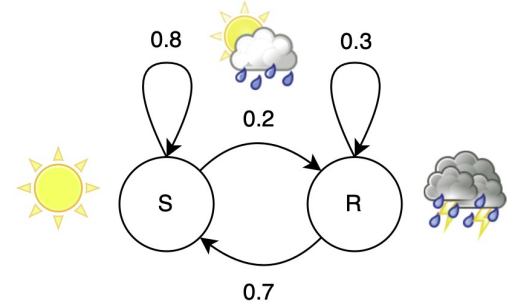

# Markov chain

It is basically a transition graph which has probability of changing to one state or another.

**Markov property:** The probability of a state transition only depends on the current state.

All the information you need (previous information) is in the state, this means that when you need to predict the future you have what you need.

### Stationary distribution

This allows to know what is the probability of each state occuring.

> Equations:
> 

$$
\begin{align*}P(S) &= 0.8 \cdot P(S) + 0.7 \cdot P(R) \\P(R) &= 0.2 \cdot P(S) + 0.3 \cdot P(R) \\1 &= P(S) + P(R)\end{align*}
$$

> Solution:
> 

$$
\begin{align*}P(S) &\approx 0.78 \\P(R) &\approx 0.22\end{align*}
$$

When probabilities can be found this means the system converges

### Generic transition graph

.png)

$$
\begin{align*}P(S) &= \frac{P(R \to S)}{P(R \to S) - P(S \to S) + 1} \\P(R) &= \frac{P(S \to R)}{P(R \to S) - P(S \to S) + 1}\end{align*}
$$

### Single literal learning: Literal Automaton

The first thing is to determine the states, but as we are using Tsetlin automata we already have them, so we just asume for this example a 4-state-automata.

.png)

### Target class: Type I Feedback (Recognize)

- If the rule condition is True: memorize all True literals in the input
- That is, increment the literal’s position in memory unless already Maximally Memorized

.png)

### Target Class: Type I Feedback (Erase)

- Forget all remaining literals by pushing them towards Maximally Forgotten.
- You forget a literal by decrementing its position with probability 1/s unless Maximally Forgotten.

.png)

### Other Class: Type II Feedback (Reject)

If the rule condition is True: memorize all Forgotten literals that are False

.png)

### Observations drive learning

What is done is based on observations learn, here

.png)

### Probability of observations

$$

P(LY), \, P(\overline{L}Y), \, P(L\overline{Y}), \text{ and } P(\overline{L}\overline{Y})

$$

Is equal to:

$$

P(L \mid Y)P(Y), \, P(\overline{L} \mid Y)P(Y), \, P(L \mid \overline{Y})P(\overline{Y}), \text{ and } P(\overline{L} \mid \overline{Y})P(\overline{Y})

$$

### Transition probabilities

$$
\begin{align*}P(i \to j) &= P(i \to j \mid \text{“Recognize”}) P(\text{“Recognize”}) \\&\quad + P(i \to j \mid \text{“Erase”}) P(\text{“Erase”}) \\&\quad + P(i \to j \mid \text{“Reject”}) P(\text{“Reject”}) \\&\quad + P(i \to j \mid \text{“No Feedback”}) P(\text{“No Feedback”}).\end{align*}
$$

> Example
> 

.png)

Replacing the values:

$$
\begin{align*}P(1 \to 2) &= 1 \cdot P(L \mid Y) P(Y) \\&\quad + 0 \cdot P(\overline{L} \mid Y) P(Y) \\&\quad + 1 \cdot P(\overline{L} \mid \overline{Y}) P(\overline{Y}) \\&\quad + 0 \cdot P(L \mid \overline{Y}) P(\overline{Y}).\end{align*}
$$

The $P(1 \to 2 \mid \overline{L} Y)$ is 0 because erase doesn’t go in that direction.

### Complete transition graph

.png)

### Stationary distribution

.png)

### Tsetlin machines forget infrequent patterns

This first example is of a non-information-relevant literal, as you can see L is not bringing much information as it is infrequent and also given its ocurance Y hapens fifty-fifty so the tendency is to forget it.

$$
\begin{align*}Forget Value: 1 \newline
P(Y|L) = 0.5 \newline
P(L) = 0.1
\end{align*}
$$

.png)

### Forget value controls forgetting

$$
Forget Value: 1/15 \newline
P(Y|L) = 0.5
$$

.png)

### Prioritizes discriminatory features

This third example is of a information-relevant literal, as you can see L is bringing much information as given its ocurance Y hapens 90% of the times so the tendency is to memorize it.

$$
Forget Value: 1/15 \newline
P(Y|L) = 0.9
$$

.png)

